# Zamin

> *"Back to basics"* — Implementing regression algorithms from scratch with a pure, low-level approach, then comparing against neural network baselines.

## Overview

This project explores **housing price prediction** on the Boston Housing dataset using multiple approaches — from hand-coded gradient descent to deep learning — to understand the fundamentals of regression at every level of abstraction.

## Dataset

**Source:** [Boston Housing (Kaggle)](https://www.kaggle.com/datasets/altavish/boston-housing-dataset)

- **506 samples**, **13 features**, **1 target** (`MEDV` — Median home value in $1000s)
- **Train/Test Split:** 80/20 (random state 42)
- **Preprocessing:** Z-score standardisation (mean/std computed on train set only, applied to both)

### Features

| Feature   | Description                                                    |
| --------- | -------------------------------------------------------------- |
| `CRIM`    | Per capita crime rate by town                                  |
| `ZN`      | Proportion of residential land zoned for lots > 25k sqft       |
| `INDUS`   | Proportion of non-retail business acres per town               |
| `CHAS`    | Charles River dummy variable (1 if tract bounds river)         |
| `NOX`     | Nitric oxide concentration (parts per 10 million)              |
| `RM`      | Average number of rooms per dwelling                           |
| `AGE`     | Proportion of owner-occupied units built pre-1940              |
| `DIS`     | Weighted distances to five Boston employment centres           |
| `RAD`     | Index of accessibility to radial highways                      |
| `TAX`     | Full-value property tax rate per $10,000                       |
| `PTRATIO` | Pupil-teacher ratio by town                                    |
| `B`       | 1000(Bk − 0.63)² where Bk is the proportion of Black residents |
| `LSTAT`   | Percentage lower status of the population                      |
| **MEDV**  | **Median value of owner-occupied homes ($1000s) — TARGET**     |

---

## Dataset Analysis

### Feature Distributions

Histograms for all 14 variables in the dataset:

<p align="center">
  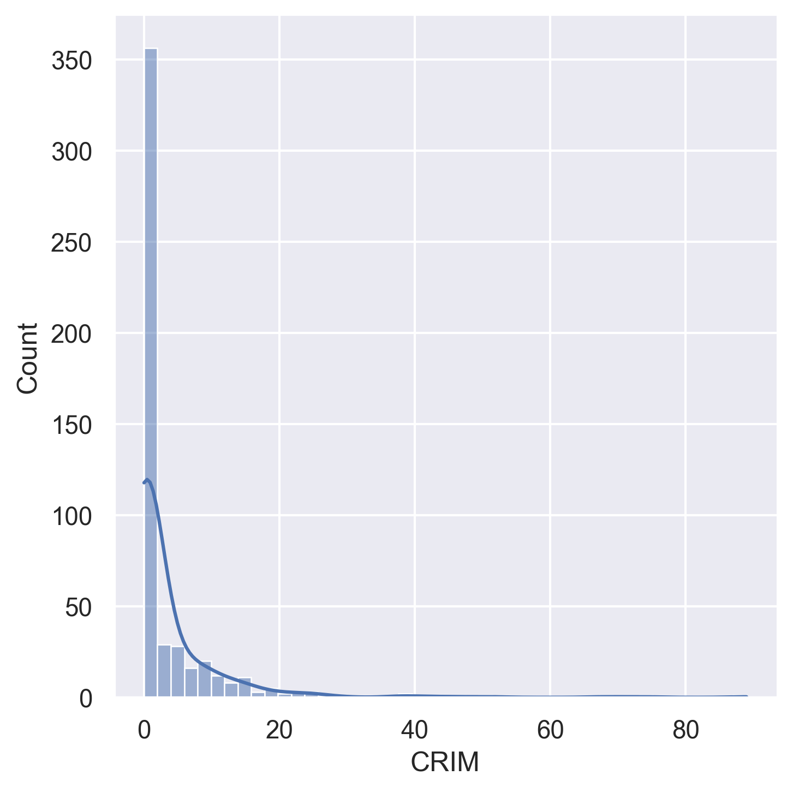   
</p>
<p align="center">
  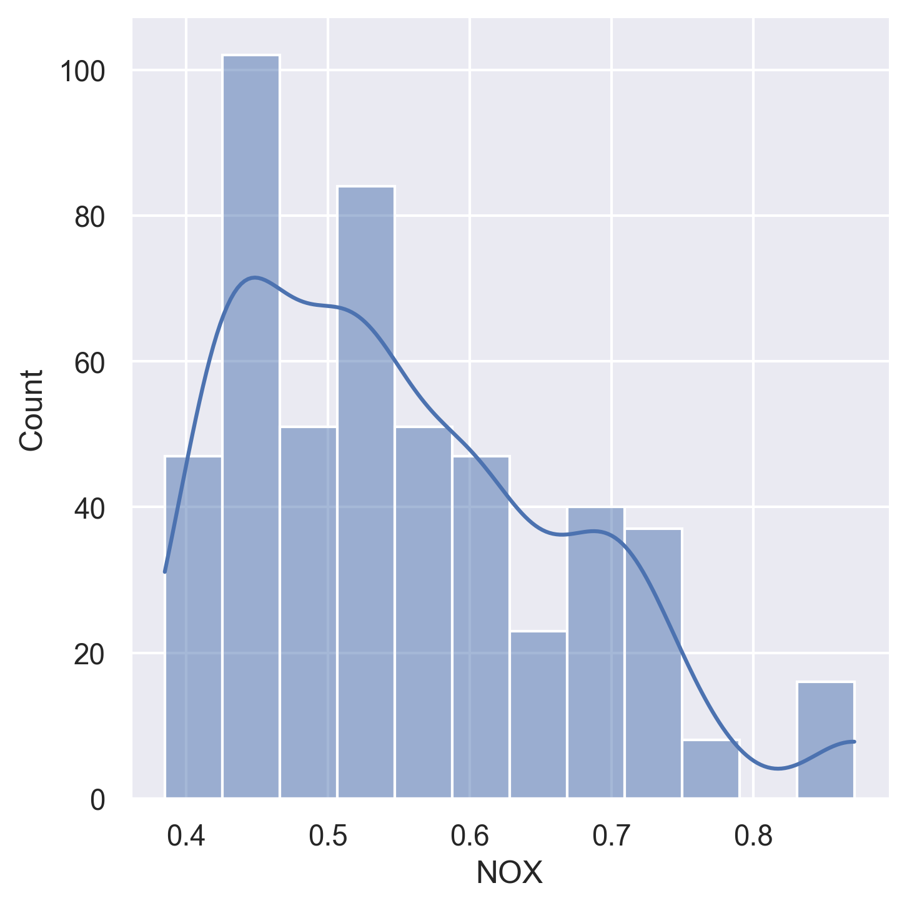 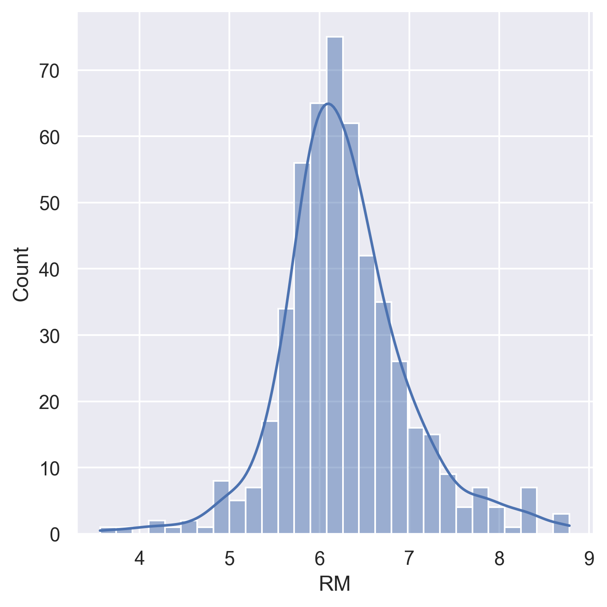  
</p>
<p align="center">
     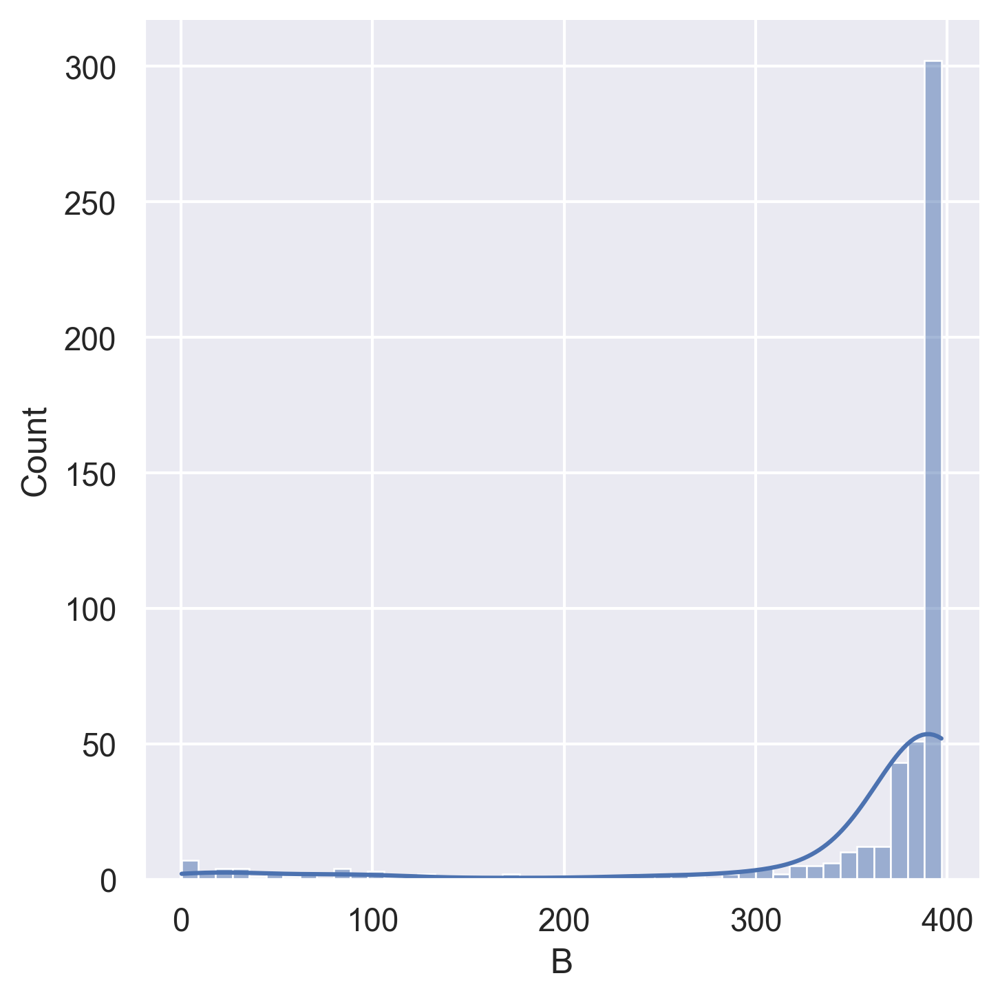
</p>
<p align="center">
  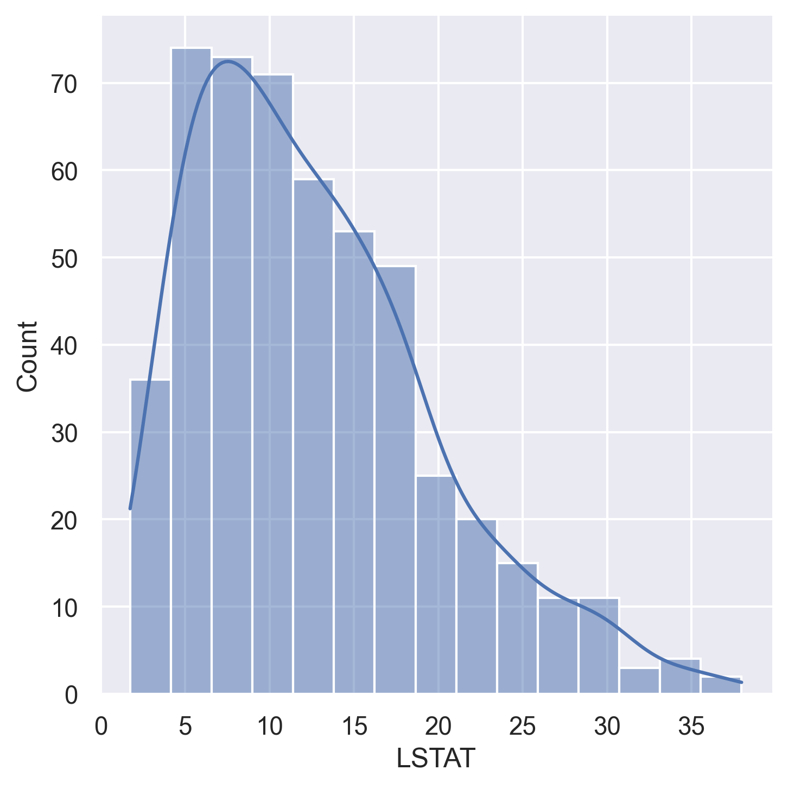 
</p>

### Correlation Analysis

|                                                              |                                                                    |
| :----------------------------------------------------------: | :----------------------------------------------------------------: |
| 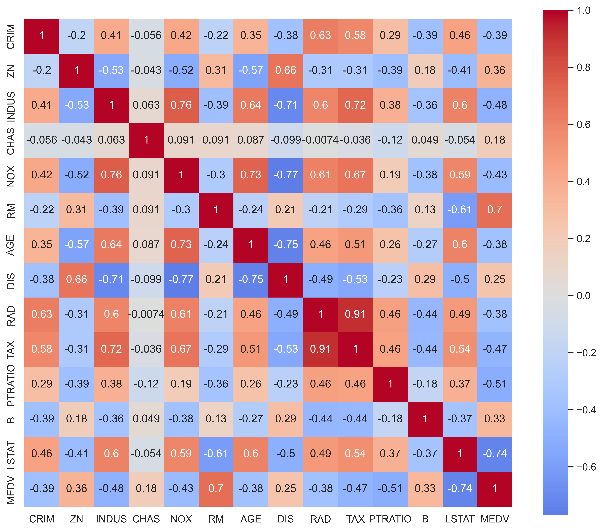 |  |
|                *Standard correlation heatmap*                |              *Hierarchical clustered correlation map*              |

**Key correlations with MEDV (target):**
- **Strong positive:** `RM` (rooms) — more rooms → higher price
- **Strong negative:** `LSTAT` (lower status %) — higher LSTAT → lower price
- **Notable negatives:** `PTRATIO`, `INDUS`, `TAX`, `CRIM`

---

## Methods Implemented

### 1. Gradient Descent — Linear Regression from Scratch (`rawRun.py`)

A **pure NumPy** implementation with no ML library abstractions:

- Manual weight initialisation (`w ~ N(0, 0.01)`, `b = 0`)
- MSE loss with analytical gradient computation
- Convergence tolerance check (`tol = 1e-4`)
- **Hyperparameters:** `α = 0.001`, `epochs = 1200`

```python
# Core update rule (no libraries)
dw = (2 / m) * X_train.T @ (y_pred - y_train)
db = (2 / m) * sum(y_pred - y_train)
w -= α * dw
b -= α * db
```

### 2. Neural Network — Keras/TensorFlow (`EvolutionaryAlgorithm.py`)

A **3-hidden-layer** dense network trained with Adam optimiser:

| Layer    | Units | Activation |
| -------- | ----- | ---------- |
| Input    | 13    | —          |
| Hidden 1 | 22    | ReLU       |
| Hidden 2 | 22    | ReLU       |
| Hidden 3 | 22    | ReLU       |
| Output   | 1     | Linear     |

- **Total parameters:** 1,343
- **Optimiser:** Adam
- **Loss:** MSE
- **Batch size:** 32, **Epochs:** 50 (with early stopping, patience=20)

### 3. Evolutionary Algorithm (Work in Progress)

Scaffolded in `EvolutionaryAlgorithm.py` — evolves neural network weights using:
- **Tournament selection** (k=3)
- **Gaussian mutation** (per-gene with configurable rate and sigma)
- **Uniform crossover** (per-gene swap with configurable rate)

> ⚠️ **Status:** Skeleton implemented — `fitness()`, `ea_training_loop()`, and `mutation()` functions are stubbed and awaiting completion.

---

## Results Comparison

### Metrics

| Metric   | Gradient Descent (Linear) | Neural Network (Keras) | Evolutionary Algorithm |
| -------- | :-----------------------: | :--------------------: | :--------------------: |
| **MSE**  |          32.406           |         12.957         |        101.712         |
| **RMSE** |           5.692           |         3.599          |         10.085         |
| **MAE**  |           3.378           |         2.399          |         7.748          |
| **R²**   |           0.558           |         0.823          |         −0.387         |


### Training Loss Curves

|                                                      |                                                                  |                                              |
| :--------------------------------------------------: | :--------------------------------------------------------------: | :------------------------------------------: |
|       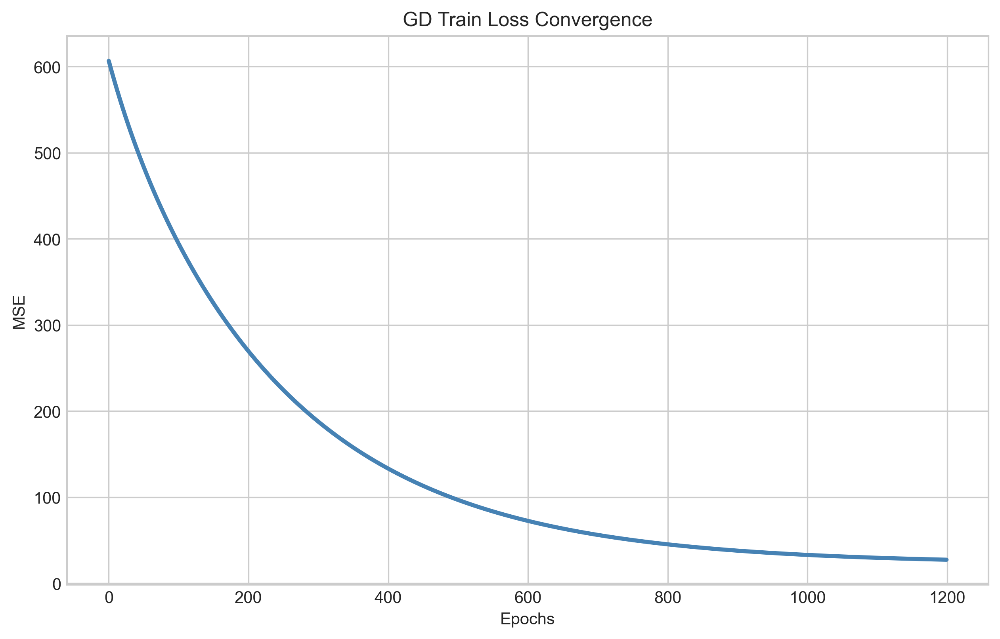       |                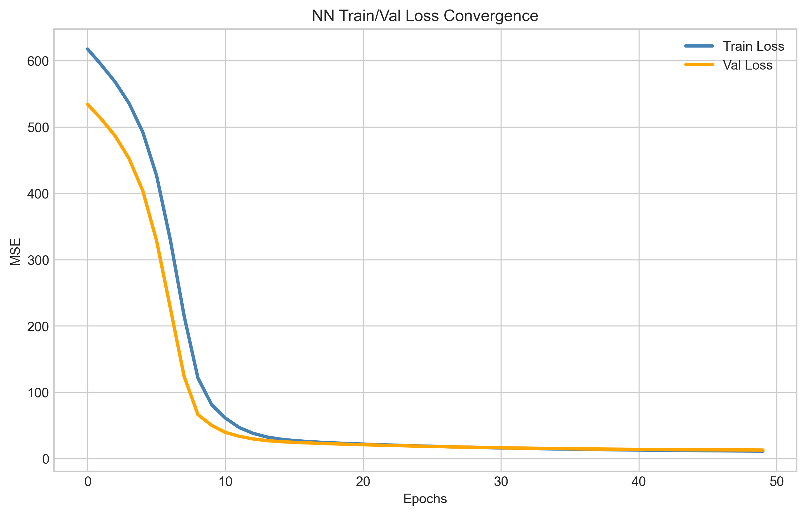                 |      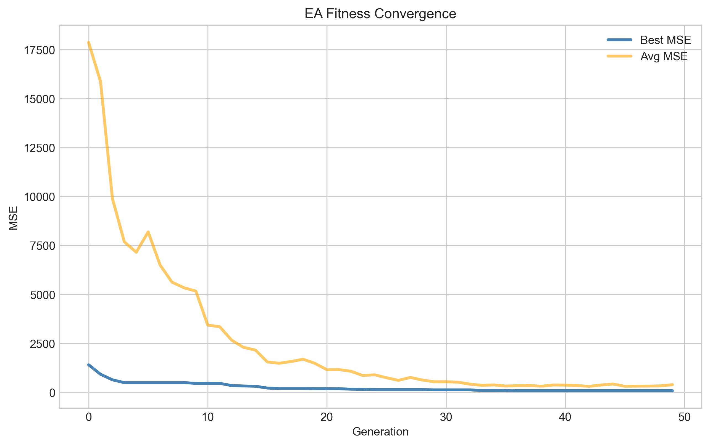       |
| *Gradient descent MSE convergence over ~1200 epochs* | *NN train/validation loss over ~50 epochs (with early stopping)* | *EA fitness convergence over 50 generations* |

### Test Set Predictions — Actual vs Predicted

|                                                  |                                              |                                              |
| :----------------------------------------------: | :------------------------------------------: | :------------------------------------------: |
| 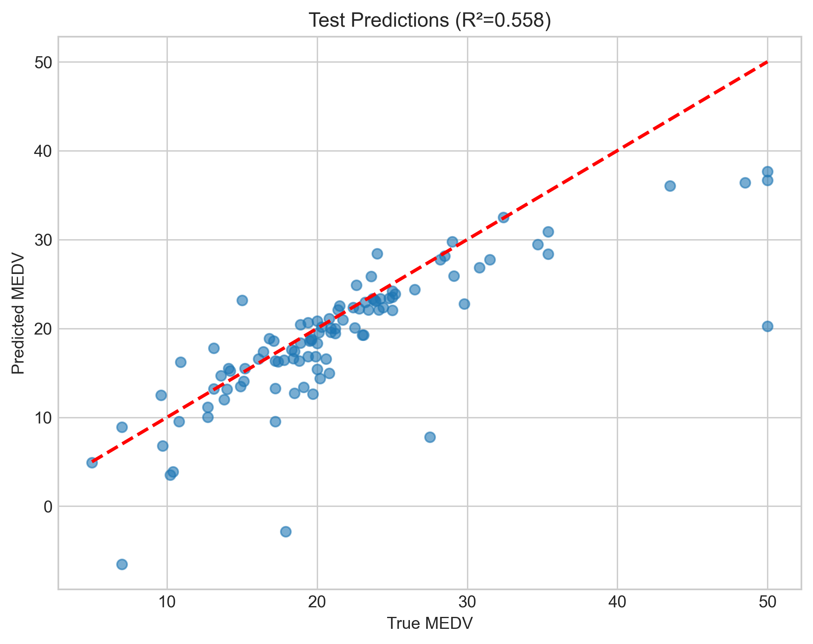 | 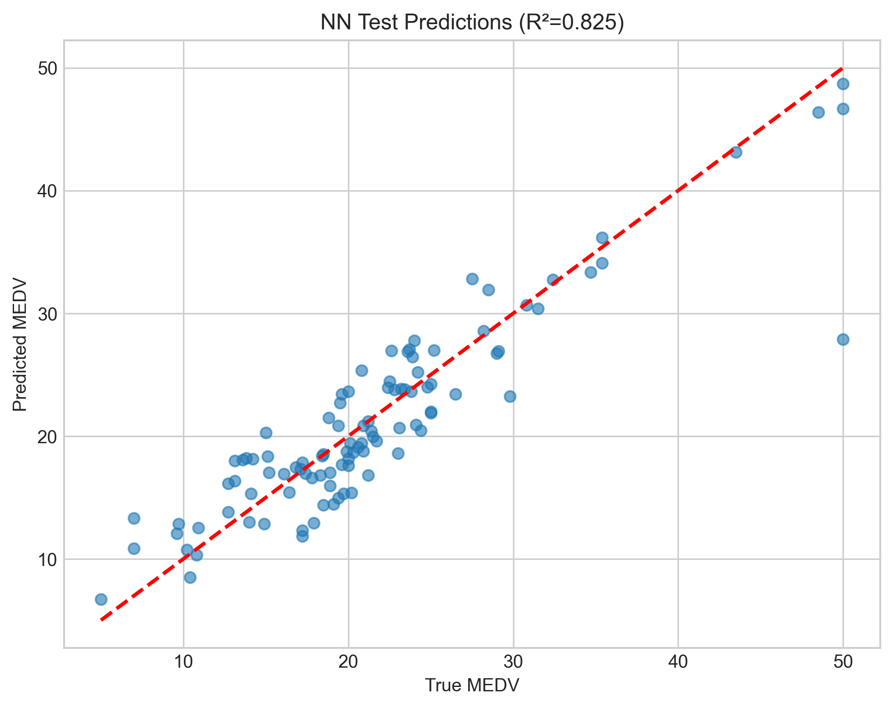 | 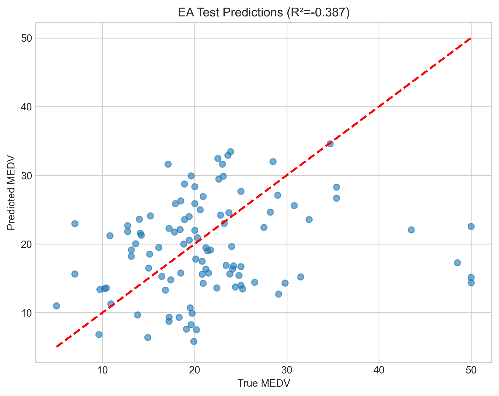 |
|          *Gradient descent predictions*          |         *Neural network predictions*         |     *Evolutionary algorithm predictions*     |

Points closer to the red dashed line (y = x) indicate better predictions. The neural network shows tighter clustering around the ideal line, especially in the mid-range values.

---

## Project Structure

```
Zamin/
├── rawRun.py                 # Gradient descent linear regression (from scratch)
├── NeuralNetwork.py          # Neural network with Keras/TensorFlow
├── EvolutionaryAlgorithm.py  # Evolutionary algorithm for NN weight optimisation
├── dataPreProcess.py         # Dataset visualisation & correlation analysis
├── housing.csv               # Boston Housing dataset (506 × 14)
├── stickyNote.txt            # Project notes & core concepts
└── output/
    ├── dataanalysis/         # Histograms, heatmaps, correlation plots
    ├── linearreg/            # GD loss curves & scatter plots
    ├── nn/                   # NN loss curves, scatter plots & saved models
    └── ea/                   # EA convergence & prediction plots
```

---

## Key Takeaways

redacted

## Future Work

redacted
